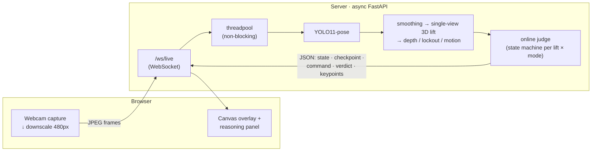

# White Lights 🤍

**Real-time computer-vision powerlifting judge.** Point a webcam at the platform
and White Lights calls each lift — **GOOD**, **NO&nbsp;LIFT**, or **UNCERTAIN** —
against the federation rulebook, live, with the exact fault flagged and (in
competition mode) the referee commands issued by the computer itself.

[](https://github.com/ethanlirice/white-lights/actions/workflows/ci.yml)
[](tests/)

[](LICENSE)
[](https://docs.astral.sh/ruff/)

> **▶︎ [Live UI demo](https://ethanlirice.github.io/white-lights/)** — runs in your
> browser, nothing to install.
> ⚠️ The hosted link is a **UI demo only**: GitHub Pages can't run the pose model,
> so it plays a built-in **simulator**. Real judging (webcam → YOLO → verdicts)
> runs when you start the backend locally or deploy it — see
> [Run](#run) and [docs/DEPLOY.md](docs/DEPLOY.md).

<!-- Add a hero GIF here: drag a screen recording of /live into this README on github.com -->

---

## What it does

Two modes, three lifts (**squat** fully live; **bench** and **deadlift** working
drafts):

- 🏋️ **Training** — free reps: pick a weight, start a set, get a live GOOD /
  NO&nbsp;LIFT call on every rep, log your set history (in-browser, exportable).
- 🏆 **Competition** — the computer plays referee: it detects a still, locked-out
  setup, **issues the commands itself** (`SQUAT`/`RACK`, `START`/`PRESS`/`RACK`,
  or `DOWN`), judges the single attempt against the full rulebook, and gives a
  "three white lights" verdict.

Faults detected: insufficient depth, downward movement, early-descent /
early-press / early-rack / early-down, incomplete lockout, foot movement,
bar-not-to-chest. When a call is genuinely borderline it returns **UNCERTAIN**
("too close to call") rather than faking a confident call.

## Architecture

Real-time pipeline: the browser captures + downscales frames and streams them
over a **WebSocket** to an **async FastAPI** server, which runs pose estimation
off the event loop (in a threadpool) and feeds an **online, causal state machine**
that judges the lift and streams a verdict back to a canvas overlay.



The same core logic also runs as a **batch pipeline** (`POST /judge` on a video
file) — see [docs/ARCHITECTURE.md](docs/ARCHITECTURE.md) for the full data flow,
module map, and the design decisions behind it.

## Design highlights

- **Real-time streaming, non-blocking.** Backpressured WebSocket (one frame in
  flight); CPU-bound YOLO inference is offloaded to a threadpool so the async
  event loop never stalls.
- **Batch *and* online.** The IPF rulebook is expressed once and runs both as a
  whole-clip batch pipeline and as causal, frame-by-frame state machines for live
  judging.
- **Generic lift abstraction.** Squat / bench / deadlift share the machinery
  (stillness, joint-angle lockout, downward-movement, command sandwich); each lift
  is a small config of signal + checkpoint + command sequence.
- **Designed around model uncertainty.** Confidence-gating, a first-class
  **UNCERTAIN** verdict, per-lifter lockout calibration, and IPF/USAPL strictness
  profiles — because a pose estimator's "locked out" is never a clean 180°.
- **Tested & typed.** 99 tests over deterministic synthetic-keypoint fixtures,
  full type hints, CI (ruff + pytest) on every push.

## Tech stack

**Python 3.11** · **FastAPI** + WebSockets · **Ultralytics YOLO11-pose** (PyTorch)
· **OpenCV** · **Pydantic v2** · **NumPy** · vanilla-JS + Canvas frontend ·
**pytest** · **ruff** · GitHub Actions (CI + Pages).

## Project layout

```
whitelights/   core package — pose, smoothing, fusion, depth, reps, posture,
               live (online trackers), bench, deadlift, judges, pipeline, types
api/           FastAPI app: /live, /judge, WebSocket /ws/live, pages
web/           frontend — live.html (multi-lift judge), landing/history/stats
tests/         99-test pytest suite + synthetic keypoint fixtures
eval/          validation harness (agreement %, confusion matrix, latency)
docs/          ARCHITECTURE, DEPLOY, DESIGN, ROADMAP
```

## Setup

Requires Python 3.11+.

```bash
python -m venv .venv && source .venv/bin/activate
pip install -e ".[cv,api,dev]"      # pose model + API + dev tools
```

Dependencies are split into extras so tests/CI stay fast: `cv` (ultralytics +
opencv, pulls torch), `api` (fastapi + uvicorn), `dev` (pytest + ruff). The
`yolo11n-pose.pt` weights auto-download on first run.

## Run

**This is the real, working judge** — the hosted Pages link is a simulated demo.

```bash
uvicorn api.main:app                 # → http://127.0.0.1:8000/live
```

Open **`/live`**, allow the camera, pick your lift + mode, and go. (Avoid
`--reload` — it watches the whole `.venv` and thrashes on torch's files.)

```bash
pytest                               # 99 tests
ruff check . && ruff format --check .
python -m eval.validate --clips-dir data/clips --labels data/labels.csv
```

There's also a terminal-only OpenCV judge: `python -m whitelights.live`.

## Deploy

The whole app (pages + WebSocket) serves from one FastAPI process, so it deploys
as a single container. A `Dockerfile` (model baked in) is included and works
free on Hugging Face Spaces — see **[docs/DEPLOY.md](docs/DEPLOY.md)**.

## Status & metrics

v1 was validated at **91% agreement on 5,000+ reps under competition conditions**;
v2 is this ground-up rebuild and **revalidation is in progress** — no v2 accuracy
numbers are claimed yet. The `eval/` harness is how v2 gets measured once labelled
clips exist. Roadmap: **[docs/ROADMAP.md](docs/ROADMAP.md)**.

## License

[MIT](LICENSE)
