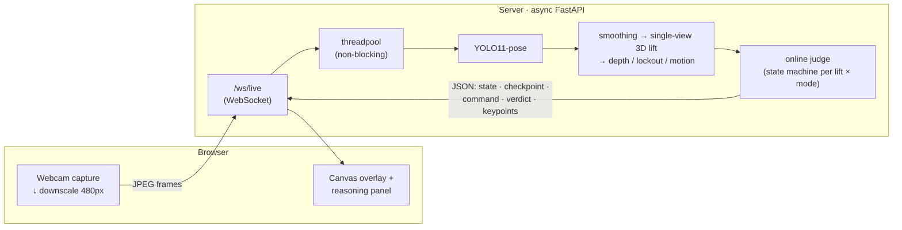

# White Lights 

**Real-time computer-vision powerlifting judge.** Point a webcam at the platform
and White Lights calls each lift — **GOOD**, **NO&nbsp;LIFT**, or **UNCERTAIN** —
against the federation rulebook, live, with the exact fault flagged and (in
competition mode) the referee commands issued by the computer itself.

[](https://github.com/ethanlirice/white-lights/actions/workflows/ci.yml)
[](tests/)

[](LICENSE)
[](https://docs.astral.sh/ruff/)

> **▶︎ [Live UI demo](https://ethanlirice.github.io/white-lights/)** — runs in your
> browser, nothing to install.
> The hosted link is a **UI demo only**: GitHub Pages can't run the pose model,
> so it plays a built-in **simulator**. Real judging (webcam → YOLO → verdicts)
> runs when you start the backend locally — see [Run](#run).

<!-- Add a hero GIF here: drag a screen recording of /live into this README on github.com -->

---

## What it does

Two modes, three lifts. All six combinations run a judge built for that
combination — no lift borrows another's. Thresholds are still unvalidated
placeholders (see [Status](#status--metrics)):

-  **Training** — free reps: pick a weight, start a set, get a live GOOD /
  NO&nbsp;LIFT call on every rep, log your set history (in-browser, exportable).
-  **Competition** — the computer plays referee: it detects a still, locked-out
  setup, **issues the commands itself** (`SQUAT`/`RACK`, `START`/`PRESS`/`RACK`,
  or `DOWN`), judges the single attempt against the full rulebook, and gives a
  "three white lights" verdict.

Faults detected: insufficient depth, downward movement, early-descent /
early-press / early-rack / early-down, incomplete lockout, foot movement,
bar-not-to-chest. When a call is genuinely borderline it returns **UNCERTAIN**
("too close to call") rather than faking a confident call.

## Architecture

Real-time pipeline: the browser captures + downscales frames and streams them
over a **WebSocket** to an **async FastAPI** server, which runs pose estimation
off the event loop (in a threadpool) and feeds an **online, causal state machine**
that judges the lift and streams a verdict back to a canvas overlay.


```mermaid
flowchart LR
  subgraph Browser
    CAM["Webcam capture<br/>↓ downscale 480px"]
    RENDER["Canvas overlay +<br/>reasoning panel"]
  end
  subgraph Server["Server · async FastAPI"]
    WS["/ws/live<br/>(WebSocket)"]
    POOL["threadpool<br/>(non-blocking)"]
    POSE["YOLO11-pose"]
    PIPE["smoothing → single-view 3D lift<br/>→ depth / lockout / motion"]
    JUDGE["online judge<br/>(state machine per lift × mode)"]
  end
  CAM -->|JPEG frames| WS --> POOL --> POSE --> PIPE --> JUDGE
  JUDGE -->|"JSON: state · checkpoint ·<br/>command · verdict · keypoints"| WS --> RENDER
```

The same core logic also runs as a **batch pipeline** (`POST /judge` on a video
file) — see [docs/ARCHITECTURE.md](docs/ARCHITECTURE.md) for the full data flow,
module map, and the design decisions behind it.

## Design highlights

- **Real-time streaming, non-blocking.** Backpressured WebSocket (one frame in
  flight); CPU-bound YOLO inference is offloaded to a threadpool so the async
  event loop never stalls.
- **Batch *and* online.** The IPF rulebook is expressed once and runs both as a
  whole-clip batch pipeline and as causal, frame-by-frame state machines for live
  judging.
- **Shared tracker machinery, separate state graphs.** Every judge draws its
  signal, body-scale reference, stillness test, command hold timer and verdict
  rule from one module (`tracking.py`), so the batch and live paths cannot drift
  apart on what a fault means. The *state graphs* stay separate on purpose: the
  deadlift has no return phase, the bench has a mid-lift `PRESS`, and forcing
  those into one parameterised graph reads worse than three explicit ones. Free
  reps are the exception — every rep cycle really is out-and-back, so one tracker
  serves all three lifts by working in travel-from-rest.
- **Designed around model uncertainty.** Confidence-gating, a first-class
  **UNCERTAIN** verdict, per-lifter lockout calibration, and IPF/USAPL strictness
  profiles — because a pose estimator's "locked out" is never a clean 180°.
- **Tested & typed.** 176 tests over deterministic synthetic-keypoint fixtures —
  including a wire-contract suite that asserts on the JSON the browser actually
  receives, not just on tracker internals. Full type hints, checked: CI runs
  ruff + **mypy** + pytest on every push.

## Tech stack

**Python 3.11** · **FastAPI** + WebSockets · **Ultralytics YOLO11-pose** (PyTorch)
· **OpenCV** · **Pydantic v2** · **NumPy** · vanilla-JS + Canvas frontend ·
**pytest** · **ruff** · GitHub Actions (CI + Pages).

## Project layout

```
whitelights/   core package — pose, smoothing, fusion, depth, reps, posture,
               tracking (shared judge machinery), live/bench/deadlift/freereps
               (online judges), camera, judges, pipeline, types, cli
api/           FastAPI app: /live, /judge, /metrics, WebSocket /ws/live, pages
web/           frontend — live.html (multi-lift judge), landing/history/stats
tests/         176-test pytest suite + synthetic keypoint fixtures
eval/          validation harness, keypoint traces, camera-geometry sweep
docs/          ARCHITECTURE, DESIGN, ROADMAP
```

## Setup

Requires Python 3.11+.

```bash
python -m venv .venv && source .venv/bin/activate
pip install -e ".[cv,api,dev]"      # pose model + API + dev tools
```

Dependencies are split into extras so tests/CI stay fast: `cv` (ultralytics +
opencv, pulls torch), `api` (fastapi + uvicorn), `dev` (pytest + ruff + mypy). The
`yolo11n-pose.pt` weights auto-download on first run.

## Run

**This is the real, working judge** — the hosted Pages link is a simulated demo.

```bash
uvicorn api.main:app                 # → http://127.0.0.1:8000/live
```

Open **`/live`**, allow the camera, pick your lift + mode, and go. (Avoid
`--reload` — it watches the whole `.venv` and thrashes on torch's files.)

Inference runs on a **bounded pool of pre-warmed models**, so no lifter pays the
model-load cost and memory cannot grow with connections. Sockets beyond capacity
are shed with an explicit "busy" rather than quietly degrading everyone already
connected. Both limits are tunable, and `/metrics` reports per-stage frame
latency (decode / model / judge), so the bottleneck is visible rather than
guessed:

```bash
WL_MAX_WORKERS=4 WL_MAX_CONNECTIONS=8 uvicorn api.main:app
curl -s localhost:8000/metrics
```

```bash
pytest                               # 176 tests
ruff check . && ruff format --check . && mypy
python -m eval.geometry                         # camera-placement envelope
python -m eval.traces extract --clips-dir data/clips --out data/traces
python -m eval.validate --traces-dir data/traces --labels data/labels.csv
```

There's also a terminal-only OpenCV judge: `python -m whitelights.cli`.

## Container

The whole app (pages + WebSocket) serves from one FastAPI process, so it runs as
a single container. The included `Dockerfile` bakes the pose weights in:

```bash
docker build -t white-lights .
docker run --rm -p 7860:7860 white-lights     # → http://127.0.0.1:7860/live
```

Note that `getUserMedia` needs HTTPS everywhere except `localhost`.

## Camera placement — measured

Single-camera depth judging compares the hip crease and the top of the knee **in
image rows**, which is only the same question when both sit at the same distance
from the lens. `eval/geometry.py` measures how far that holds: it projects a
sagittally realistic squat through a virtual camera, runs the result back through
the real pipeline, and compares against ground truth from the 3D trace it started
from — so it needs no footage.

```bash
python -m eval.geometry          # operating envelope
```

| true depth below parallel | camera may be off-axis by | pitch ±40° | height 0.3–2.2 m |
|---|---|---|---|
| 8 cm | 82° | ok | ok |
| 4 cm | 42° | ok | ok |
| 2 cm | 18° | fails | ok |
| ≤1 cm | — | fails | fails |

**Two findings.** *Yaw is what matters* — pitch is a pure rotation about the lens
(a homography), so it cannot reorder two points vertically and therefore cannot
flip a hip-vs-knee row comparison; height leaves hip and knee in nearly the same
depth plane. Swinging **off-axis** is different: it rotates the knees' forward
travel into the depth axis, creating exactly the parallax one view cannot
recover. *And the landmark mattered more than the lens* — the judge was measuring
the hip **joint**, not the **crease**, a constant bias that missed every
below-parallel frame on a borderline rep until `hip_crease_thigh_fraction` was
added.

Practical version: **film square to the platform.** Height and tilt are forgiving;
rotation is not, and the shallower the rep the less of it you get.

## Status & metrics

v1 was validated at **91% agreement on 5,000+ reps under competition conditions**;
v2 is this ground-up rebuild and **revalidation is in progress** — no v2 accuracy
numbers are claimed yet. The geometry envelope above is a *bound on the method*,
not an accuracy measurement: it says where a correct pipeline stays correct, not
how often this one is. Real agreement needs labelled clips through
`eval/validate.py`. Roadmap: **[docs/ROADMAP.md](docs/ROADMAP.md)**.

## License

[MIT](LICENSE)
