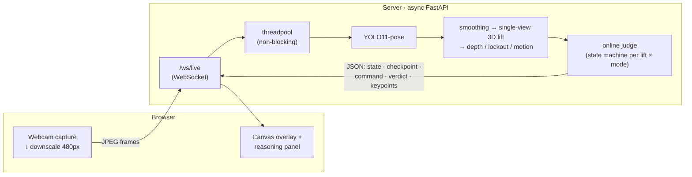

# White Lights

**Real-time computer-vision powerlifting judge.** Point a webcam at the platform
and White Lights calls each lift — **GOOD**, **NO&nbsp;LIFT**, or **UNCERTAIN** —
against the federation rulebook, live, with the exact fault flagged and (in
competition mode) the referee commands issued by the computer itself.

[](https://github.com/ethanlirice/white-lights/actions/workflows/ci.yml)
[](tests/)

[](LICENSE)
[](https://docs.astral.sh/ruff/)

> **▶︎ [Live UI demo](https://ethanlirice.github.io/white-lights/)** — runs in your
> browser, nothing to install. GitHub Pages can't run the pose model, so this is
> a **UI demo only**, backed by a built-in simulator. Real judging (webcam →
> YOLO → verdicts) needs the backend running locally — see [Run](#run).

<!-- Add a hero GIF here: drag a screen recording of /live into this README on github.com -->

---

## What it does

Two modes, three lifts, all six combinations judged by a dedicated tracker —
no lift borrows another's. Thresholds are still unvalidated placeholders (see
[Status](#status--metrics)):

- **Training** — free reps: pick a weight, start a set, get a live GOOD /
  NO&nbsp;LIFT call on every rep, log your set history (in-browser, exportable).
- **Competition** — the computer plays referee: detects a still, locked-out
  setup, **issues the commands itself** (`SQUAT`/`RACK`, `START`/`PRESS`/`RACK`,
  or `DOWN`), judges the attempt against the full rulebook, and gives a
  "three white lights" verdict.

Faults detected: insufficient depth, downward movement, early-descent /
early-press / early-rack / early-down, incomplete lockout, foot movement,
bar-not-to-chest. A genuinely borderline call returns **UNCERTAIN** rather
than a faked confident one.

## Architecture

The browser streams downscaled frames over a **WebSocket** to an **async
FastAPI** server, which runs pose estimation off the event loop and feeds an
**online, causal state machine** that judges the lift and streams a verdict
back to a canvas overlay:


```mermaid
flowchart LR
  subgraph Browser
    CAM["Webcam capture<br/>↓ downscale 480px"]
    RENDER["Canvas overlay +<br/>reasoning panel"]
  end
  subgraph Server["Server · async FastAPI"]
    WS["/ws/live<br/>(WebSocket)"]
    POOL["threadpool<br/>(non-blocking)"]
    POSE["YOLO11-pose"]
    PIPE["smoothing → single-view 3D lift<br/>→ depth / lockout / motion"]
    JUDGE["online judge<br/>(state machine per lift × mode)"]
  end
  CAM -->|JPEG frames| WS --> POOL --> POSE --> PIPE --> JUDGE
  JUDGE -->|"JSON: state · checkpoint ·<br/>command · verdict · keypoints"| WS --> RENDER
```

The same core logic also runs as a **batch pipeline** (`POST /judge` on a video
file). Full data flow, module map, and design rationale:
**[docs/ARCHITECTURE.md](docs/ARCHITECTURE.md)** / **[docs/DESIGN.md](docs/DESIGN.md)**.

## Highlights

- **Non-blocking real time.** Backpressured WebSocket, CPU-bound YOLO
  inference offloaded to a threadpool, a bounded pool of pre-warmed models so
  no lifter pays the load cost — see [Run](#run).
- **One rulebook, two execution modes.** Expressed once, run both as a
  whole-clip batch pipeline and as causal frame-by-frame state machines,
  sharing signal/scale/verdict logic (`tracking.py`) so the two paths can't
  drift apart on what a fault means.
- **Designed around model uncertainty.** Confidence-gating, a first-class
  **UNCERTAIN** verdict, per-lifter lockout calibration, and IPF/USAPL
  strictness profiles — a pose estimator's "locked out" is never a clean 180°.
- **Tested across the stack.** 186 Python tests (including a wire-contract
  suite asserting on the exact JSON the browser receives) + 51 Vitest cases
  over the frontend's pure logic. CI runs ruff, mypy, pytest, vitest, and
  pip-audit on every push; Dependabot covers pip, npm, and the Actions.

## Tech stack

**Python 3.11** · **FastAPI** + WebSockets · **Ultralytics YOLO11-pose** (PyTorch)
· **OpenCV** · **Pydantic v2** · vanilla JS + Canvas, pure logic as native ES
modules (`web/lib/`) · **pytest** · **Vitest** · **ruff** · GitHub Actions.

## Project layout

```
whitelights/   core package — pose, smoothing, fusion, depth, reps, posture,
               tracking (shared judge machinery), live/bench/deadlift/freereps
               (online judges), camera, judges, pipeline, types, cli
api/           FastAPI app: /live, /judge, /metrics, /lib/* (JS modules),
               WebSocket /ws/live, pages
web/           frontend — live.html (multi-lift judge), landing/history/stats;
               web/lib/ holds the pure logic those pages import as ES modules
tests/         186-test pytest suite + synthetic keypoint fixtures
eval/          validation harness, keypoint traces, camera-geometry sweep
docs/          ARCHITECTURE, DESIGN, ROADMAP
```

## Setup

Requires Python 3.11+.

```bash
python -m venv .venv && source .venv/bin/activate
pip install -e ".[cv,api,dev]"      # pose model + API + dev tools
```

Extras: `cv` (ultralytics + opencv, pulls torch), `api` (fastapi + uvicorn),
`dev` (pytest + ruff + mypy), `onnx` (export tooling, see
`eval/export_onnx.py`). Weights auto-download on first run.

The frontend's pure logic has its own test runner — optional for running the
app, only needed to touch `web/lib/`:

```bash
npm install && npm test
```

## Run

**This is the real, working judge** — the hosted Pages link is a simulated demo.

```bash
uvicorn api.main:app                 # → http://127.0.0.1:8000/live
```

Open **`/live`**, allow the camera, pick your lift + mode, and go. (Avoid
`--reload` — it watches the whole `.venv` and thrashes on torch's files.)

Capacity is tunable and observable rather than a black box — sockets beyond
the limit are shed with an explicit "busy," and `/metrics` reports per-stage
frame latency:

```bash
WL_MAX_WORKERS=4 WL_MAX_CONNECTIONS=8 uvicorn api.main:app
curl -s localhost:8000/metrics
```

```bash
pytest && npm test                              # 186 + 51 tests
ruff check . && ruff format --check . && mypy
python -m eval.geometry                         # camera-placement envelope
python -m eval.traces extract --clips-dir data/clips --out data/traces
python -m eval.validate --traces-dir data/traces --labels data/labels.csv
```

There's also a terminal-only OpenCV judge: `python -m whitelights.cli`.

## Container

One FastAPI process serves pages + WebSocket, so it runs as a single
container. The included `Dockerfile` bakes the pose weights in:

```bash
docker build -t white-lights .
docker run --rm -p 7860:7860 white-lights     # → http://127.0.0.1:7860/live
```

`getUserMedia` needs HTTPS everywhere except `localhost`.

## Camera placement — measured

Single-camera depth judging compares the hip crease and top of the knee **in
image rows**, which only holds when both sit at the same distance from the
lens. `eval/geometry.py` measures how far that assumption survives — no
footage needed, since it projects a known 3D trace through a virtual camera
and checks the pipeline's call against ground truth from the trace itself.

```bash
python -m eval.geometry          # operating envelope
```

| true depth below parallel | camera may be off-axis by | pitch ±40° | height 0.3–2.2 m |
|---|---|---|---|
| 8 cm | 82° | ok | ok |
| 4 cm | 42° | ok | ok |
| 2 cm | 18° | fails | ok |
| ≤1 cm | — | fails | fails |

**Film square to the platform.** Yaw (swinging off-axis) is what moves the
call — it rotates the knees' forward travel into the depth axis; height and
pitch barely register. The shallower the rep, the less rotation the method
tolerates. Findings and why: **[`eval/geometry.py`](eval/geometry.py)**.

## Status & metrics

v1 was validated at **91% agreement on 5,000+ reps under competition
conditions**; v2 is this ground-up rebuild and **revalidation is in
progress** — no v2 accuracy numbers are claimed yet. The geometry envelope
above bounds the *method*, not this pipeline's accuracy: it says where a
correct implementation stays correct, not how often this one is. Real
agreement needs labelled clips through `eval/validate.py`.
Roadmap: **[docs/ROADMAP.md](docs/ROADMAP.md)**.

## License

[MIT](LICENSE)
